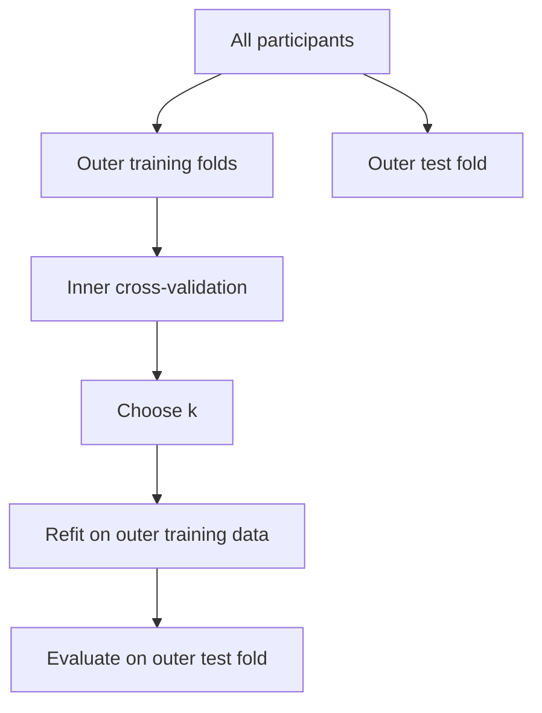

```text
WPs/WP27_EXERCISE_4_VALIDATION_AND_CROSS_VALIDATION.md
```

Produce:

```text
WPs/reports/WP27_REPORT.md
WPs/reports/WP27_EXACT_CHANGELOG.md
```

## 1. Purpose

Replace the current Exercise 4 placeholder with a concise, self-learning notebook titled:

```text
Exercise 4: Validation and Cross-Validation
```

The notebook should teach:

1. why one train/test split can be unstable, especially in small datasets;
2. how to evaluate a fixed model using cross-validation;
3. how train, validation, and test sets support hyperparameter tuning;
4. how nested cross-validation separates tuning from evaluation;
5. how to implement these ideas with KNN regression.

Do not include the planned logistic-regression classification section. That application will be assigned as homework later.

A single closing sentence may tell students that they will apply the same workflow to logistic regression in homework. Do not create the homework in this WP.

## 2. Verify the starting state

Run and record:

```bash
git status --short --branch
git branch --show-current
git rev-parse HEAD
git rev-parse origin/main
git log --oneline --decorate -10
```

Expected:

* current branch: `main`;
* local `main`: WP26R documentation commit, approximately `74c9a9a`;
* `origin/main`: WP26R production release, approximately `44739b3`;
* local `main` is exactly one documentation-only commit ahead;
* the archive branch remains at `914841c4c6033f232d96ce33b6dbcc23eda1c766`.

The only allowed untracked files are:

```text
WPs/reports/WP16_ARCHITECT_REPORT.md
WPs/reports/WP21_DEPLOYMENT_REPORT.md
```

Leave them untouched.

If the state differs materially, stop. Do not reset, rebase, stash, clean, delete, or automatically resolve divergence.

## 3. Create the WP27 branch and specification

Create:

```bash
git switch -c feature/wp27-validation-cross-validation
```

Write this complete specification to:

```text
WPs/WP27_EXERCISE_4_VALIDATION_AND_CROSS_VALIDATION.md
```

Commit the specification before implementation.

Do not merge, push, deploy, monitor GitHub Actions, or begin WP28.

## 4. Read existing standards and related notebooks

Before implementation, read:

* `NOTEBOOK_AUTHORING_STANDARDS.md`;
* Exercise 2 canonical and portable notebooks;
* Exercise 3 canonical and portable notebooks;
* the current Exercise 4 placeholder;
* existing widget components and generators;
* portable-notebook generation scripts;
* current Exercise 2 KNN configuration and data definitions.

Reuse the established:

* page structure;
* concise "What This Notebook Covers" style;
* green run/download block;
* blue Think First boxes;
* hidden familiar data-loading inputs with visible outputs;
* code-cell hiding conventions;
* portable-notebook behavior;
* light/dark-mode plot styling;
* responsive interaction design;
* student-facing language standards.

## 5. Preserve project scope

Use the same ABIDE age-prediction task and fixed KNN predictor set already established in Exercise 2 wherever technically appropriate.

Do not introduce:

* feature selection;
* logistic-regression code;
* classification CV;
* stratified CV;
* LDA;
* regularization;
* bootstrap;
* new scientific claims;
* additional datasets;
* final-project material.

Feature selection belongs to Exercise 5.

Do not update:

* the Syllabus page;
* Word course-overview files;
* `scripts/build_course_overview_docx.py`;
* Exercises 1-3;
* Exercises 5-12, apart from navigation changes strictly required by replacing the Exercise 4 placeholder.

## 6. Convert Exercise 4 into a real notebook

Replace the Exercise 4 Markdown placeholder with:

```text
book/chapters/chapter_04/exercise_04.ipynb
```

Remove the obsolete placeholder source after confirming the archive and Git history preserve it.

Update:

* `_toc.yml`;
* Contents links;
* structural tests;
* launch-button mappings;
* portable-notebook configuration;
* any page-type assumptions that currently treat Exercise 4 as a placeholder.

The active Exercise 4 route must remain:

```text
chapters/chapter_04/exercise_04.html
```

Exercises 5-12 remain minimal placeholders.

## 7. Opening structure

Use this exact main title:

```markdown
# Exercise 4: Validation and Cross-Validation
```

Follow it with the same green run/download block used in the current completed exercises.

Add a concise:

```markdown
## What This Notebook Covers
```

Suggested wording:

> Exercise 4 introduces validation and cross-validation. We will compare a single train/test split with cross-validation, tune a KNN regression model, and use nested cross-validation to keep model tuning separate from model evaluation.

Then list, in simple language:

1. examine why results can depend on one random split;
2. evaluate a fixed model across several folds;
3. use training, validation, and test data for tuning;
4. tune and evaluate KNN with nested cross-validation.

Do not mention logistic regression in the opening list.

## 8. Notebook structure

Use the following main structure, adjusting numbering only if required for a coherent notebook:

```text
1. Our Regression Data
2. From One Split to Cross-Validation
3. Cross-Validation for a Fixed KNN Model
4. Train, Validation, and Test Data
5. Tune KNN Without Looking at the Test Set
6. Nested Cross-Validation
7. Choosing a Validation Strategy
```

Keep the notebook shorter than Exercise 1.

Avoid repeating explanations between adjacent sections.

## 9. Section 1: Our Regression Data

Reuse the ABIDE regression table and age target from Exercise 2.

Requirements:

* hide familiar loading and setup code inputs by default;
* keep a concise output showing the data used;
* identify age as the prediction target;
* identify the fixed predictors;
* state that the predictors were fixed before this validation lesson;
* do not perform or teach feature selection;
* preserve participant exclusions and missing-data handling already established for this task.

Briefly remind students:

* KNN uses distances;
* predictors must be scaled;
* scaling must be learned from training data only;
* a scikit-learn `Pipeline` keeps scaling inside each training fold.

Do not reteach KNN theory extensively.

## 10. Section 2: From One Split to Cross-Validation

Begin with the familiar train/test approach.

Explain concisely:

* one split is not wrong;
* its result depends on which participants enter each subset;
* this dependence is more important when the available sample is small;
* cross-validation evaluates the model across several partitions.

Do not claim that ABIDE is generally too small or that its full-sample result is unreliable.

### 10.1 Small-sample audit

Before choosing interactive sample-size controls, inspect the actual ABIDE results.

Audit a transparent predefined sample-size grid that includes small values, for example:

```text
30, 50, 75, 100, 150, 250, 500, all eligible participants
```

Adjust only when required by:

* the chosen number of folds;
* the fixed KNN value;
* minimum fold size;
* numerical validity.

Use a predefined seed sequence. Do not search for a few unusually dramatic seeds and present them as representative.

For each sample size, compare across the same seed set:

* one train/test result;
* mean cross-validation result;
* variability across splits or fold assignments;
* training/test/fold sizes.

Determine at which sample sizes the instability is visually meaningful.

If the effect is mainly visible below \(N=100\), include those smaller sizes in the interaction and state explicitly:

> The full ABIDE sample is relatively large for this demonstration. The small-sample settings represent research situations in which only tens of participants are available.

Do not describe score differences as "statistically significant" unless an actual inferential test is performed. This activity concerns stability and variability, not null-hypothesis significance.

Record the complete audit table in a development artifact or report. Do not overwhelm students with the full audit inside the notebook.

## 11. Combined Interactive Activity 1

Create one combined activity rather than separate train/test-instability and CV activities.

Suggested title:

```text
One Split or Several Folds?
```

### Controls

Include only controls that produce clear educational comparisons:

* sample size;
* random seed;
* number of folds: preferably 3, 5, and 10 where valid;
* fixed KNN \(k\);
* optionally test-set proportion if it does not overcrowd the activity.

Use discrete audited values rather than expensive continuous recomputation.

The seed should alter the partitioning. Prefer a fixed nested participant sample for each sample-size level so changing the split seed primarily demonstrates partition instability rather than simultaneously replacing the entire participant sample.

If the architecture makes this impractical, document exactly what the seed changes.

### Display

The activity should show:

* the selected single-split test score;
* single-split results across the predefined seeds;
* one score per CV fold;
* mean CV score;
* variability across folds or seeds;
* number of training participants;
* number of test participants;
* training and validation size within each CV fold.

Use MSE as the primary metric because it is the later tuning criterion.

You may also show \(R^2\) for continuity with Exercise 2, but do not use two metrics to choose the model.

Clearly label:

* lower MSE is better;
* fold results;
* mean result;
* score variability.

Do not imply that cross-validation guarantees a better score. Its purpose here is to use several partitions and provide a less split-dependent assessment.

### Questions

Place concise questions around the activity:

* How much does the result change when only the split changes?
* Is the variability larger with 50 participants or with the full sample?
* Could two researchers using different splits reach different conclusions?
* Does increasing the number of folds always improve the model?
* What changes when the number of folds increases?

Scope the conclusion to small-sample research when that is what the data demonstrate.

## 12. Section 3: Cross-Validation for a Fixed KNN Model

After the combined activity, show a standard Python example using:

* `Pipeline`;
* `StandardScaler`;
* `KNeighborsRegressor`;
* `KFold`;
* `cross_validate` or an equally clear scikit-learn function.

Use a fixed, predeclared value of \(k\). At this stage the model is evaluated, not tuned.

Explain:

1. split the participants into \(K\) folds;
2. fit on \(K-1\) folds;
3. evaluate on the remaining fold;
4. repeat until every fold has been used for evaluation;
5. summarize the fold results.

Briefly explain scikit-learn's negative-MSE scoring convention and convert the displayed results back to ordinary positive MSE.

Show:

* MSE for each fold;
* mean MSE;
* standard deviation;
* optionally mean \(R^2\).

Keep the interpretation concise.

If this code partially reproduces the interactive activity:

* collapse the complete input/output cell on the website;
* use a clear reveal label such as "Show the Python version";
* retain visible runnable code in the portable notebook.

## 13. Section 4: Train, Validation, and Test Data

Explain the three roles:

| Subset          | Purpose                              |
| --------------- | ------------------------------------ |
| Training data   | Fit model parameters                 |
| Validation data | Compare hyperparameter values        |
| Test data       | Evaluate the selected procedure once |

Introduce "hyperparameter" in plain language:

> A hyperparameter is a model setting chosen before fitting. For KNN, the number of neighbours \(k\) is a hyperparameter.

Explain the procedure:

1. fit candidate KNN models on training data;
2. compare their validation MSE;
3. choose \(k\) using validation data;
4. refit using training and validation data;
5. evaluate once on untouched test data.

State clearly:

> Looking at the test result repeatedly turns the test set into another validation set.

Do not overexpand this section.

## 14. Guiding questions before tuning

Before revealing tuning results, add a blue Think First box containing questions based on this wording:

* Which value of \(k\) do you expect to perform best on the training set: the value selected using training error or the value selected using validation error?
* Which value do you expect to perform better on unseen test participants?
* Why might the value that gives the lowest training error fail on new participants?
* Should you change \(k\) after seeing the test result?

Use terms such as:

* "training-selected \(k\)";
* "validation-selected \(k\)".

Define both terms immediately before the questions.

Do not present the answers before the activity.

## 15. Section 5: Tune KNN Without Looking at the Test Set

Create the second main interactive activity.

Suggested title:

```text
Choose k Before Revealing the Test Set
```

### Required behavior

1. Display training and validation performance across candidate \(k\) values.
2. Identify:

   * training-selected \(k\);
   * validation-selected \(k\).
3. Let the student choose or confirm a final \(k\).
4. Keep test results hidden initially.
5. Provide a button:

   ```text
   Lock Choice and Reveal Test Result
   ```
6. Once pressed:

   * disable tuning controls or clearly freeze the choice;
   * reveal test MSE and \(R^2\);
   * compare the chosen value with the training-selected and validation-selected values.
7. Provide a separate:

   ```text
   Reset Activity
   ```

   control.

The reset must make it clear that repeated resets and test inspection would be invalid in a real analysis.

### Interpretation

After the result is revealed, explain:

* the training-selected value is expected to look best on training data because it was selected there;
* the validation-selected value is expected to generalize better;
* it is not guaranteed to win on every single test split;
* test-set randomness can occasionally favor another value;
* the choice must not be changed after seeing the test result.

Do not manipulate the seed solely to guarantee the desired winner.

### Portable notebook

The portable notebook cannot reproduce the browser's lock state exactly.

Use two stages:

1. a visible runnable cell that calculates training and validation results;
2. a separate "reveal test result" cell.

Do not save the test-result output in the portable notebook. Students should have to run that cell to reveal it.

Document this as an intentional pedagogical exception to ordinary saved-output behavior.

## 16. Section 6: Nested Cross-Validation

Explain why a single train/validation/test split may be inefficient when data are limited.

Use this distinction:

* inner CV chooses \(k\);
* outer CV evaluates the complete tuning procedure.

Include a compact diagram:



Explain that the outer test fold must not participate in:

* scaling;
* choosing \(k\);
* comparing candidate models;
* preprocessing decisions.

State that different outer folds may choose different \(k\) values. This is expected because each outer training set contains different participants.

## 17. Nested-CV KNN code example

Show one complete KNN regression pipeline using:

* `Pipeline`;
* `StandardScaler`;
* `KNeighborsRegressor`;
* inner `KFold`;
* outer `KFold`;
* `GridSearchCV`;
* a short candidate grid of \(k\) values;
* MSE as the tuning metric;
* outer-fold MSE and \(R^2\) as reported metrics.

Use distinct fixed random seeds for inner and outer partitioning.

Prefer an explicit outer loop if it makes these results easier for beginners to inspect:

| Outer fold | Selected \(k\) | Outer-test MSE | Outer-test \(R^2\) |
| ---------- | -------------: | -------------: | -----------------: |

Then display:

* mean outer-test MSE;
* MSE variability;
* mean outer-test \(R^2\);
* selected \(k\) values across outer folds.

Do not describe the best inner-CV score as the final performance estimate.

Keep scaling inside the pipeline so it is fitted separately in every training fold.

## 18. Interactive Activity 3: Inside Nested CV

Create a compact nested-CV explorer.

Suggested title:

```text
Look Inside Nested Cross-Validation
```

### Controls

* outer fold;
* candidate-\(k\) grid, using a small number of predefined grids;
* inner-fold count, if audited and educationally useful.

### Display

For the selected outer fold, show:

* inner-CV mean MSE for every candidate \(k\);
* selected \(k\);
* outer-test MSE;
* outer-test \(R^2\);
* training and test participant counts.

Also show a summary across all outer folds:

* selected \(k\) per fold;
* outer-fold scores;
* mean and variability.

Questions:

* Why can different outer folds select different values of \(k\)?
* Which result estimates future performance: the best inner score or the outer score?
* Why must the outer-test score not influence the selected \(k\)?
* What would go wrong if scaling were fitted before creating the folds?

Use precomputed, seeded results for the GitHub Pages interaction.

Do not run nested sklearn searches dynamically in the browser.

## 19. Section 7: Choosing a Validation Strategy

End with this concise comparison:

| Situation                                | Appropriate approach               |
| ----------------------------------------- | ----------------------------------- |
| Large dataset and fixed model            | Train/test split may be sufficient |
| Tune a model with enough data            | Train/validation/test split        |
| Evaluate a fixed model with limited data | Cross-validation                   |
| Tune and evaluate with limited data      | Nested cross-validation            |

Add:

> Nested cross-validation estimates the performance of the complete tuning procedure. After evaluation, a final model can be tuned and fitted using all available development data, but its performance estimate still comes from the outer folds.

Add one short note:

> In the homework, you will apply the same workflow to logistic-regression classification.

Do not include logistic-regression code, results, controls, or explanations.

Add one concise independence caveat:

> These examples treat participants as independent observations. Repeated measurements from the same participant would need to remain together in the same fold.

Do not expand this into grouped or site-based cross-validation.

## 20. Interactive implementation requirements

Follow the established interactive architecture.

Create appropriate:

* widget components;
* typed configurations;
* compact binary or JSON data exports;
* manifests;
* notebook iframe blocks;
* iframe-resize support;
* portable replacements;
* frontend tests;
* Playwright tests.

Suggested component identities may resemble:

```text
validation-stability
validation-lock-test
nested-cv-explorer
```

Use project naming conventions after inspecting the current architecture.

Requirements:

* responsive desktop and narrow-screen layout;
* accessible labels;
* keyboard-accessible controls;
* no horizontal clipping;
* matching light/dark themes;
* transparent Plotly drag layers;
* readable axes and gridlines;
* no bright or mismatched plot backgrounds;
* meaningful loading and error states;
* deterministic default state;
* no runtime internet dependency.

Do not duplicate large datasets separately for every configuration when a compact shared representation is possible.

Report the added compressed and uncompressed asset sizes.

## 21. Audit interaction claims

Add an audit script or deterministic analysis artifact for:

* sample-size stability configurations;
* split seeds;
* CV fold counts;
* fixed \(k\) values;
* training-selected \(k\);
* validation-selected \(k\);
* nested-CV selected \(k\) values;
* outer-fold metrics.

The report must distinguish:

* patterns that hold consistently;
* patterns that hold mainly for \(N<100\);
* outcomes that vary by split;
* teaching claims that are expectations rather than guarantees.

Do not cherry-pick without disclosure.

## 22. Portable notebook

Create and register an Exercise 4 portable notebook.

Requirements:

* correct Exercise 4 title;
* correct Colab and download links;
* familiar loading code available;
* website widgets replaced by runnable Python equivalents;
* ordinary reproduction code and output visible;
* test-result reveal output intentionally absent;
* no frontend dependency;
* no local absolute paths;
* required package-installation cell consistent with current portable notebooks;
* runnable from top to bottom in Colab, Jupyter, or VS Code.

Update the launch-button mapping so Exercise 4 receives working:

* Colab;
* download `.ipynb`;

controls.

Exercises 5-12 must remain without launch buttons while they are placeholders.

## 23. Student-facing editing standards

All prose, code comments, plot labels, controls, errors, and questions must address students.

Use:

* "cross-validation," not unexplained "CV" on first use;
* "hyperparameter" only after defining it;
* "number of neighbours \(k\)" before using \(k\) alone;
* "participants," not generic "rows," where scientifically appropriate;
* "lower MSE is better" near tuning results.

Avoid:

* internal script names;
* audit filenames;
* WP references;
* developer notes;
* "honest/invalid" labels;
* claims that cross-validation makes a model better;
* claims that the full ABIDE dataset demonstrates a small-sample problem;
* excessive theoretical detail.

Do not define a time budget.

Not every question requires a revealable answer.

## 24. Website cell visibility

On the built website:

* hide familiar data-loading inputs;
* keep useful data previews visible;
* collapse lengthy code/output that merely reproduces an interactive activity;
* keep the first essential cross-validation and nested-CV worked examples discoverable through clearly labelled toggles;
* do not hide the conceptual explanations or questions.

In the portable notebook:

* retain runnable code;
* retain ordinary saved outputs;
* preserve the intentional locked-test exception described above.

## 25. Tests

Add focused Python tests covering at least:

1. Exercise 4 is an `.ipynb`, not a placeholder Markdown page.
2. Correct title and capitalization.
3. Concise "What This Notebook Covers."
4. Correct section order.
5. Familiar loading code is hidden with output retained.
6. Same ABIDE age-prediction task as Exercise 2.
7. No feature-selection lesson.
8. No logistic-regression implementation.
9. No classification or stratification section.
10. One homework bridge sentence only.
11. Combined stability/CV interaction occurs once.
12. Small sample sizes are present when justified by the audit.
13. Small-sample conclusion is not attributed to full ABIDE.
14. No statistical-significance language is used for score variability.
15. Fixed-model CV example uses scaling inside a pipeline.
16. Train/validation/test roles are defined.
17. Guiding questions compare training-selected and validation-selected \(k\).
18. Test result is initially hidden in the website activity.
19. Test controls lock after reveal.
20. Reset behavior is explicit.
21. Nested-CV example uses inner and outer loops.
22. Scaling occurs within folds.
23. Outer metrics—not inner tuning scores—are presented as performance estimates.
24. Independence caveat is present.
25. Exercise 4 portable notebook exists.
26. Portable test-result output is absent.
27. Exercise 4 launch links are correct.
28. Exercises 5-12 remain placeholders without launch buttons.
29. Syllabus source is unchanged.
30. No final-project text is introduced.

Add frontend unit and Playwright tests for:

* configuration validation;
* deterministic defaults;
* control changes;
* sample-size controls;
* seed controls;
* fold controls;
* correct metrics;
* lock/reveal/reset state;
* nested outer-fold selection;
* responsive layout;
* light/dark Plotly styling;
* transparent drag layers;
* missing-asset errors;
* no runtime console errors.

## 26. Bounded validation

Run, in order:

1. data/audit scripts;
2. focused Exercise 4 Python tests;
3. portable-notebook generation check;
4. Exercise 4 portable smoke execution;
5. frontend typecheck;
6. focused frontend unit tests;
7. one production frontend build;
8. one Jupyter Book build;
9. focused Playwright widget tests;
10. focused built-book Playwright tests for Exercise 4 in light and dark modes;
11. full Python suite once;
12. full frontend unit suite once.

Do not rerun unrelated Playwright suites for Exercises 1-3 unless a shared component changed.

For each failed gate, allow:

* one diagnosis and correction;
* one rerun of that gate.

If it still fails, stop and report. Do not enter loops.

## 27. Manual verification

Inspect the built Exercise 4 and confirm:

* the notebook is concise and coherent;
* no placeholder remains;
* the combined first activity is not duplicated;
* small-\(N\) controls are understandable;
* claims are properly scoped;
* guiding questions precede test revelation;
* test results are hidden initially;
* nested CV is visually understandable;
* code toggles work;
* portable behavior is appropriate;
* light and dark plots match the surrounding page;
* narrow-screen controls and plots remain usable;
* no stale Exercise 4 placeholder text remains;
* no Exercise 5 material has been introduced.

## 28. Reports

Create:

```text
WPs/reports/WP27_REPORT.md
WPs/reports/WP27_EXACT_CHANGELOG.md
```

The report must include:

* success or failure;
* starting and final SHAs;
* final notebook outline;
* sample-size audit results;
* whether meaningful instability required \(N<100\);
* exact sample sizes and seeds used;
* exact fixed and candidate \(k\) values;
* interaction descriptions;
* training-selected and validation-selected outcomes;
* nested-CV fold results;
* any changes in results compared with Exercise 2;
* portable-notebook behavior;
* test-result reveal exception;
* asset sizes;
* light/dark verification;
* tests and builds run;
* corrections or reruns;
* deviations;
* final Git state.

The exact changelog must list every created, modified, moved, and deleted file.

## 29. Completion state

Commit:

1. WP27 specification;
2. implementation;
3. reports.

Stop with all work local on:

```text
feature/wp27-validation-cross-validation
```

Do not:

* merge;
* push;
* deploy;
* monitor GitHub Actions;
* update the Word overview;
* update the Syllabus page;
* begin WP28.
